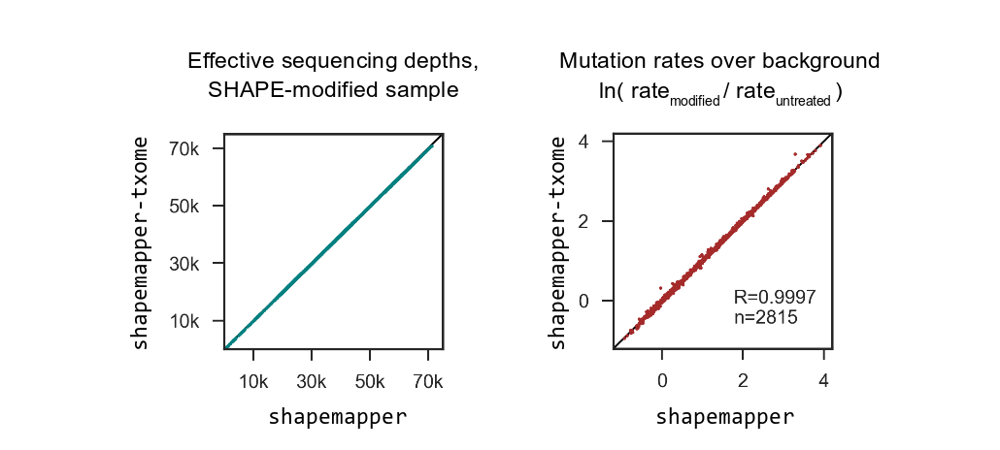

# shapemapper-txome
*Copyright 2018 Steven Busan*. This project is licensed under the terms of the 
MIT license.

Wrapper scripts for running [ShapeMapper2](https://github.com/Weeks-UNC/shapemapper2) 
with large numbers of transcript targets. Performs a fast
pseudoalignment with `kallisto` (or accepts an existing alignment in SAM/BAM format), 
then sorts and bins reads by target and runs
separate `shapemapper` instances on each target and associated reads.

Warning: these scripts are in active development and are untested
on large datasets.

- [Validation](#validation)
- [Dependencies](#dependencies)
- [Parameters](#parameters)
- [Example usage](#example-usage)
- [Testing](#testing)
- [Notes](#notes)
- [Limitations](#limitations)

---

## Validation

On a dataset from extracted _E. coli_ ribosomes modified
with the SHAPE reagent 1-methyl-7-nitroisatoic anhydride (1M7),
`kallisto-txome` produces nearly identical mutation rates above
background and effective read depths as running `shapemapper`
directly.

On a dataset from extracted _E. coli_ ribosomes modified with
2-methylnicotinic acid imidazolide (NAI), mutation rates and
read depths are again nearly identical.

## Dependencies

- 64-bit Linux
- python >= 2.7 (tested with 2.7.6, 2.7.15, and 3.5.5)
- [kallisto](https://pachterlab.github.io/kallisto/) (tested with 0.44.0)
- [samtools](http://www.htslib.org/) (tested with 1.2 and 1.8)
- sort (tested with GNU coreutils sort 8.21 and 8.22)
- [ShapeMapper2](https://github.com/Weeks-UNC/shapemapper2) (tested with 2.1.2 and 2.1.3)

### Parameters

    -h, --help          show help message and exit

    --paired
    --unpaired

    --modified <file|folder> [<fileB|folderB> ...] 
                        Input files: compressed or uncompressed FASTQ files, 
                        listed in pairs of R1 R2, or folders of the same, or 
                        SAM/BAM file (treated sample).
    --untreated <file|folder> [<fileB|folderB> ...]
                        Input files (untreated sample).

    --target <target1.fa> [<target2.fa> ...]
                        FASTA file(s) containing target sequences.

    --out <str>         Output folder (default: output)

    --min-reads <int>
                        Minimum reads pseudomapping to a target for target
                        inclusion in shapemapper runs. (0 to disable).
                        (default: 10)

    --min-mean-coverage <int>
                        Minumum estimated mean read depth (from pseudomapping)
                        over the length of a given target for target inclusion
                        in shapemapper runs. (0 to disable). (default: 0)

    --multimapper-mode <str>
                        Behavior for a given read pseudomapping to multiple
                        targets. 
                           "exclude": discard all
                           "first": use first listed target
                           "random": randomly select target
                           "all": duplicate read to all mapped targets
                        (default: "exclude")

    --fragment-length <int>
                        Expected mean insert fragment size. Required if input
                        is unpaired, or if '--min-mean-coverage' > 0.
                        (default: 150)

    --fragment-sd <int>
                        Expected insert fragment size standard deviation.
                        (default: 20)

    --platform <str>    Subprocess execution platform: "lsf", "local", or
                        "sge" (default: local)

    --max-jobs <int>    Maximum jobs that will be simultaneously submitted for
                        execution. (default: 1)

    --shapemapper-args <str>
                        Additional arguments to pass to each shapemapper run
                        (enclose these in quotes on the commandline).

    --nproc <int>       Number of CPUs available to bowtie2 and kallisto
                        (default: 4)

    --max-files-per-folder <int>
                        Maximum number of files to create within any folder.
                        (default: 100)

## Example usage

  ``shapemapper-txome --shapemapper-args '--random-primer-len 9' --paired --modified modified_fastqs --untreated untreated_fastqs --target 16S.fa 23S.fa TPP.fa``

## Testing

  ``shapemapper-txome --test``

This will run on a partial dataset included with these scripts. 
It should complete without error in about 1 minute, producing
the folder `test`. Note: due to the low read depth, 
SHAPE reactivity profiles from this dataset are not usable.

## Notes

Final shapemapper outputs will be located in `output/shapemapper`,
inside arbitrary subdirectories to avoid large numbers of files
in any given folder.

Default behavior is to discard any targets with fewer than 10
total reads pseudoaligning in either sample (controlled with
the `--min-reads` parameter). An alternative filter requires
a minimum estimated average read depth (controlled with the
`--min-mean-coverage` parameter, and disabled by default). If
enabled, this filter requires the `--fragment-length` and 
`--fragment-sd` parameters.

Kallisto discards read ID past the first whitespace char, so
these scripts also adhere to that convention. 

## Limitations

All alignment information in input SAM/BAM files other than read sequence, 
basecall quality scores, and mapped target is discarded (that is,
`shapemapper` performs a second alignment). This may change in the future,
if `shapemapper` is adapted to accept SAM/BAM inputs directly.

The scripts provided here are not optimized to minimize disk usage. Expect
output and intermediate files to have a total size 10-15x that of the
compressed FASTQ input files.

Unpaired inputs are currently untested.

Job submission platform support is currently untested (that is, 
enabling subprocess parallelization by setting `--platform` 
to anything other than `local`, and setting `--max-jobs` > 1).
SGE is probably broken; LSF might be functional.

